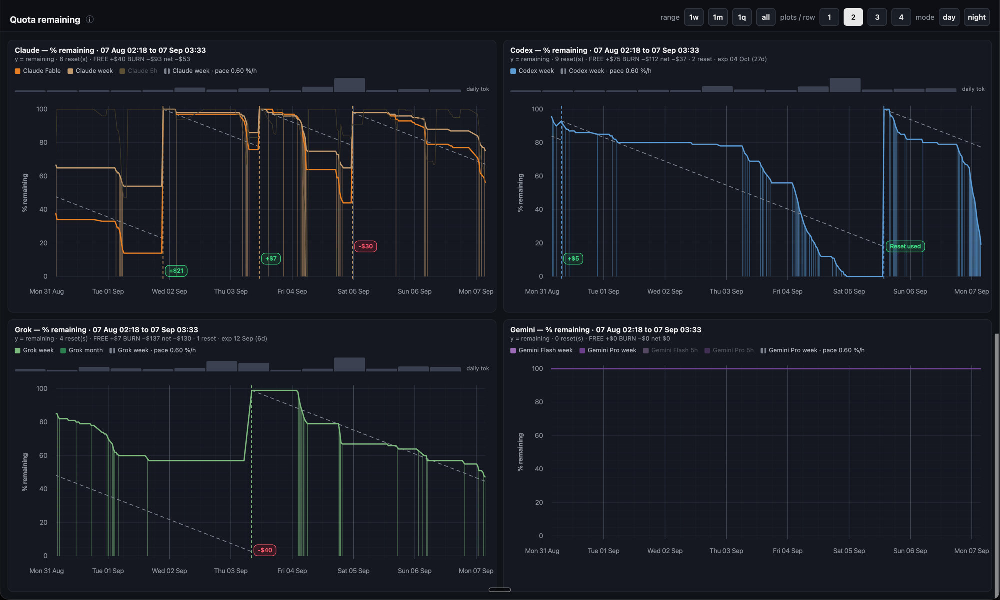

<h1 align="center">
   ai-quotas
</h1>

<p align="center">
  <strong>See remaining subscription quota as it burns.</strong><br/>
  Claude, Codex, Grok, and Gemini on one dash — sampled from your logged-in CLIs, stored on disk.<br/>
  <small>Gemini needs an extra adapter; it is not included in the public package.</small>
</p>

<p align="center">
  <a href="https://github.com/calmmage/ai-quotas"></a>
  <a href="https://github.com/calmmage/ai-quotas/actions/workflows/test.yml"></a>
  <a href="LICENSE"></a>
  
  
  
</p>

<p align="center">
  <a href="https://code.claude.com/docs"><kbd>Claude</kbd></a>
  &nbsp;
  <a href="https://github.com/openai/codex"><kbd>Codex</kbd></a>
  &nbsp;
  <a href="https://x.ai/cli"><kbd>Grok</kbd></a>
  &nbsp;
  <a href="https://gemini.google.com"><kbd>Gemini</kbd></a>
</p>

<h3 align="center"><a href="#install"><ins>Install ai-quotas</ins></a></h3>

<p align="center">
  <a href="docs/examples/dash-night.png"></a>
</p>

> Vendor usage endpoints are unofficial and can change. This tool uses **your** credentials, read-only. Use at your own risk.

## Install

Needs **Python ≥ 3.11**, **[uv](https://docs.astral.sh/uv/)**, and **make**.

```bash
git clone https://github.com/calmmage/ai-quotas.git
cd ai-quotas
make setup                 # uv sync --extra all + doctor
```

Core runtime is **stdlib-only**; `make setup` also installs the plot dependencies. Samples stay on this machine (`~/.local/share/ai-quotas/` by default). ai-quotas needs no separate account; live data uses your existing vendor logins.

**Agents:** follow **[AGENTS.md](AGENTS.md)** for installation, logins, and optional automation.

### Open your dashboard

Log into the vendor CLIs you use, then:

```bash
make sample                # collect once from your logged-in CLIs
make dash                  # generate and open the local dashboard
```

The dashboard opens at `http://127.0.0.1:8765/live.html`. Leave it running to view new samples; run `make sample` again to collect them. Optional scheduled sampling is covered in [AGENTS.md](AGENTS.md).

To try the table offline without vendor accounts:

```bash
AI_QUOTAS_SAMPLES=tests/fixtures/multi.jsonl uv run ai-quotas --no-refresh
```

## What you get

| Surface | Command |
|---------|---------|
| **Table** | `uv run ai-quotas` — used% · burn vs need · reset ETA · color pace |
| **Dash** | `make dash` — % remaining over time, money markers, reset-credit badges |
| **Verdicts** | `uv run ai-quotas verdicts` — `STOP` / `WARN` / `OK` (exit 2 / 1 / 0) |
| **Alerts** | Telegram when you are **burning** a still-high bar, or a **reset is soon** with leftover quota |
| **Spend** | `uv run ai-quotas spend` — local session tokens/$ (Claude / Codex / Grok logs) |
| **Automation** | `make install-automation` — sample every 30m + dash KeepAlive + weekly spend check |

The default 2×2 is **Claude / Codex / Grok / Gemini**. Gemini is a drop-in extra adapter (`AI_QUOTAS_EXTRA_ADAPTERS`). OpenRouter is a built-in adapter, shown with `--full`, not on that 2×2.

## Give this to an agent

Paste:

> Clone https://github.com/calmmage/ai-quotas and follow **[AGENTS.md](AGENTS.md)**. Install [uv](https://docs.astral.sh/uv/) if missing. Do not invent an install path. Vendor CLI logins are the human's. Skip Gemini unless they give you an extra adapter (`AI_QUOTAS_EXTRA_ADAPTERS`). Then `make sample && make dash`.

The guide also covers optional macOS LaunchAgents, Telegram alerts, and Healthchecks pings.

## Docs

| | |
|---|---|
| Agent install / deploy / integrate | [AGENTS.md](AGENTS.md) |
| Plot engines, money, reset credits | [docs/PLOTS.md](docs/PLOTS.md) |
| Sample-row contract + verdicts | [docs/CONTRACT.md](docs/CONTRACT.md) |
| Token leftover labels | [docs/TOKEN-GAUGE.md](docs/TOKEN-GAUGE.md) |
| Security reports | [SECURITY.md](SECURITY.md) |

```bash
make test     # offline
make doctor   # resolved paths
```

## License

MIT — see [LICENSE](LICENSE). Vulnerabilities: [SECURITY.md](SECURITY.md).
