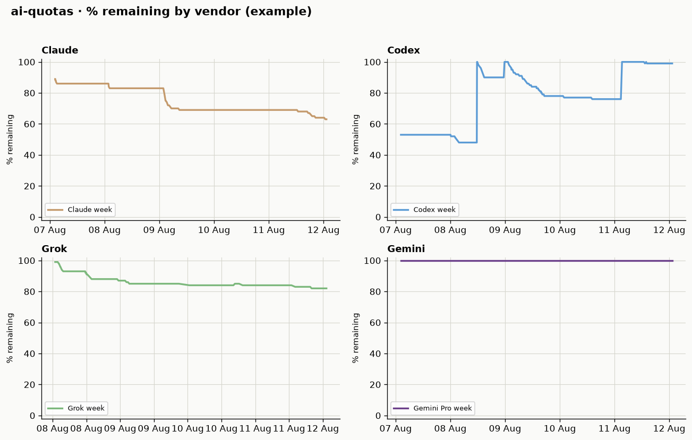
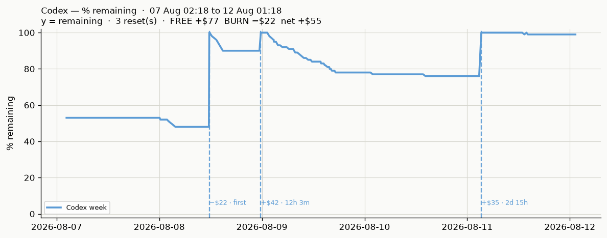

# Plots

Interactive multi-vendor dashboards for subscription quota **% remaining** over time.

## What you get

| Engine | File | Notes |
|--------|------|--------|
| Plotly | `<data_dir>/plots/03_plotly/index.html` | Light theme, hover tooltips |
| uPlot | `<data_dir>/plots/10_uplot/index.html` | Dark canvas, fast |
| Index | `<data_dir>/plots/00_INDEX.html` | Links + money table |

Each page shows **all four vendors** (Claude / Codex / Grok / Gemini) with:

- **plots / row** control (1–4) + auto-scale on resize
- family colors (orange / blue / green / purple)
- resets from used% drops (not claimed `resets_at`)
- money markers: first reset = burn (−$); early reset within window = free (+$)
- denser grid + burn-density ticks under the curve

Default `data_dir` is `~/.local/share/ai-quotas` (override with `AI_QUOTAS_DATA_DIR` / `AI_QUOTAS_SAMPLES`).

## CLI

```bash
uv sync --extra plot
uv run ai-quotas plot                          # live samples path
uv run ai-quotas --samples path/to.jsonl plot  # explicit file (root flag)
uv run ai-quotas plot --out ./my-plots --open
uv run ai-quotas plot --money                  # also print $ report
```

## Library

```python
from pathlib import Path
from ai_quotas import generate_plots, prepare_plots, is_reset, classify_money

df, resets, cutoff = prepare_plots(Path("samples.jsonl"))
result = generate_plots(samples=Path("samples.jsonl"), out_dir=Path("/tmp/qplots"))
print(result["index"])
```

Core install stays **stdlib-only**. Plot stack is optional: `ai-quotas[plot]` → pandas, matplotlib, plotly.

## Example previews (static)

Generated from live samples; committed as docs imagery only (not live dashboards).

### All vendors



### Codex (resets + money labels)



## Money rules (short)

1. First reset on a series → **burn** (leftover remaining valued as lost $).
2. Reset before a full expected window since last burn → **free** (+$).
3. Reset after a full window → new **burn**.
4. Rolling 5h session windows are **not priced** (label only).

Rates: Claude/Codex $200/mo · Grok $300/mo · Gemini $30/mo, pro-rated to window length.

## Sources-only policy

Dashboards are **generated at runtime** and live under the data dir (gitignored). This repo ships generators + static README examples, not full interactive HTML trees.
